# KPCA Appliqué

Ce petit write up fait suite à celui sur la découverte des KPCA disponible sur le dépot github **[ici](https://github.com/Matomatt/wyes-ai/tree/KPCA/Decouverte_KPCA)**. 
## Sommaire
- [KPCA Appliqué](#kpca-appliqué)
  - [Sommaire](#sommaire)
  - [1. Notre problème](#1-notre-problème)
  - [2. Reduction d'une dimension](#2-reduction-dune-dimension)
  - [3. Reduction de deux dimensions](#3-reduction-de-deux-dimensions)
  - [4. Reduction de quatre dimensions](#4-reduction-de-quatre-dimensions)
  - [5. Notre code](#5-notre-code)
  - [6. Resultats](#6-resultats)
      - [Notre conclusion :](#notre-conclusion-)

## 1. Notre problème
La lecture des informations provenant du dispositif est composé de 12 capteurs (6 pour le coté gauche et 6 autres pour le cotés droit) ce qui nous offres un mouvement un décrit par **6 dimensionalités** pour chaque œil.

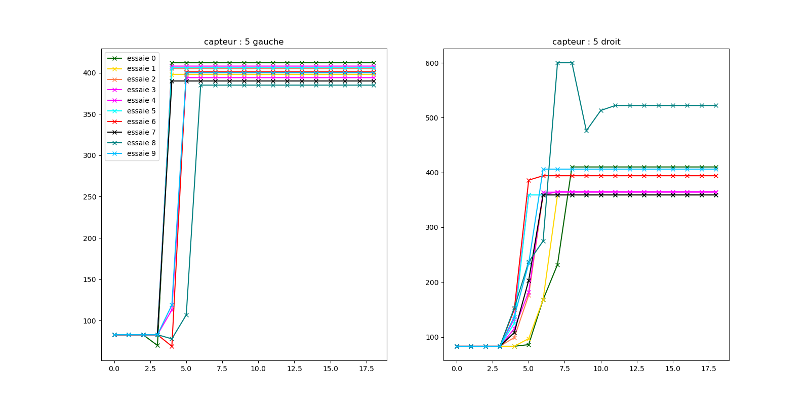

> le graphique de gauche correspond aux 6 capteurs de gauche et le graphique de droite aux 6 capteurs situés à à droite. 

Afin d'optimiser et de simplifier notre démarche de reconnaissance et d'identification des mouvements, nous **nous proposons de réduire un maximum le nombre de composantes disponibles**. Nous utiliserons ici le principe de réduction de dimensionnalités permise par les KPCA.   
## 2. Reduction d'une dimension
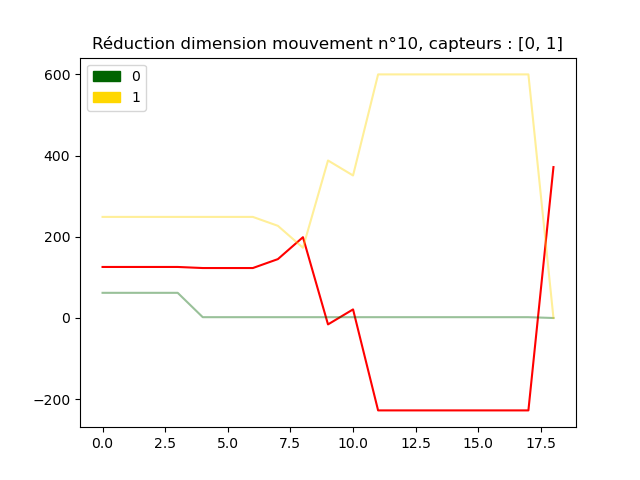
> Ici nous avons "fait" fusionner la ligne des **capteurs 1 et 2** _(n°0 et n°1)_ respectivement en jaune et en vert pour obtenir **la ligne en rouge** 
## 3. Reduction de deux dimensions
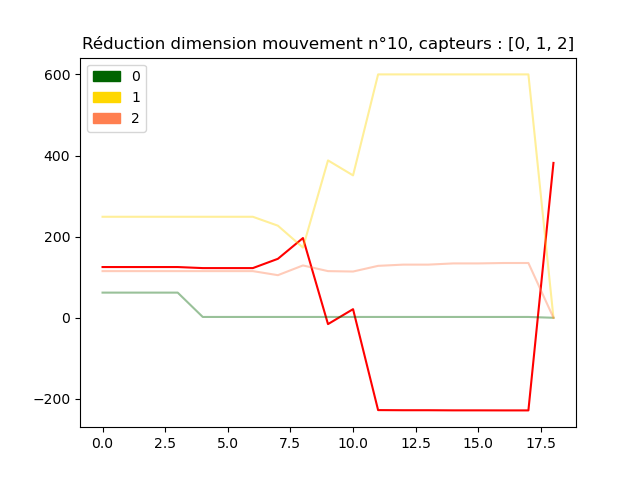
> Ici nous avons "fait" fusionner la ligne des **capteurs 1 , 2 et 3** _(n°0 , n°1 et n°2)_ respectivement en jaune , vert  et en orange pour obtenir **la ligne en rouge** 
## 4. Reduction de quatre dimensions
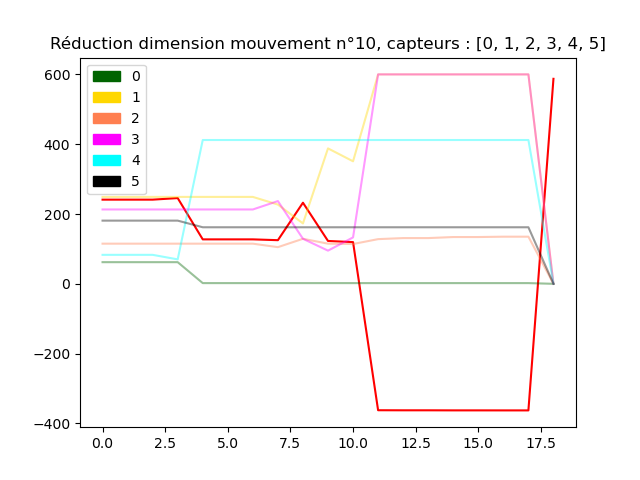
> Ici nous avons "fait" fusionner la ligne des **capteurs 1 , 2 ,3 , 4 et 5** _(n°0 , n°1 , n°2, n°3 , n°4 et n°5)_ respectivement en vert, jaune, orange, magenta, cyan et noir pour obtenir **la ligne en rouge** 
## 5. Notre code
A terme pour réduire les 12 entrées _(6 capteur pour chaque oeil)_ nous utilisons la méthode **DimensionReduction()** pour recuperer un tableau avec deux colonnes (oeil gauche et oeil droit).
L'integralité du code se situe dans la classe [movement](movement.py). Le playload qui nous a permis de generer les images de ce write up est disponible dans le fichier [playload](playload.py)
Plusieurs méthodes ont été implémentés dans la classe **movement** : 
* Le constructeurs et les méthodes d'initialisation (tel que la lecture du dataset)
* Les methodes permettant de generer une visualition graphique des mouvements en fonction des capteurs et etc.
* La méthode **dimensionReduction** qui permet de "fusionner" deux capteurs afin de réduire le nombre de dimensions
## 6. Resultats
* Nous allons ici prendre le mouvement n°10 et le comparer aux autres pour savoir si cette reduction de dimensionalité ne rend pas impossible l'identification d'un mouvement par rapport à un autre. Nous obtenons la figure ci-dessous via les lignes `mov = m.dimensionReduction(numberOfDimension = 1)` et `showResult(mov)`.
  
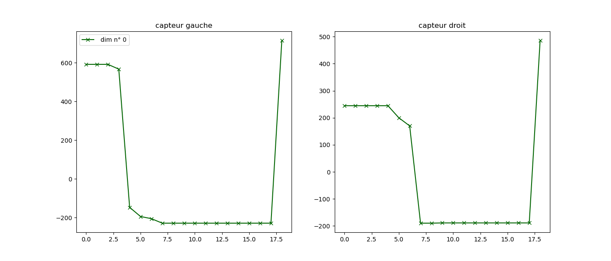
> mouvement n°1 avec 1 dimension

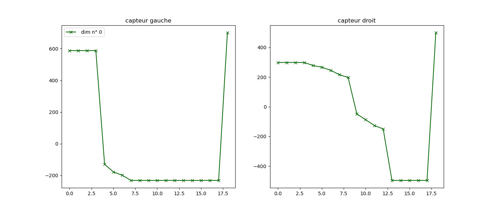
> mouvement n°4 avec 1 dimension **(même mouvement mais répétition différente)**

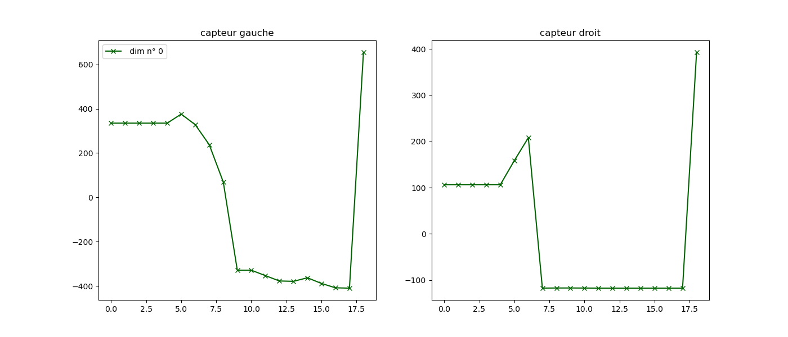
> mouvement n°30 avec 1 dimension **(mouvement différents)**

* Nous allons effectuer la même démarche mais avec cette fois-ci **2 dimension** via les lignes `mov = m.dimensionReduction(numberOfDimension = 2)` et `showResult(mov)` 

> mouvement n°1 avec 2 dimensions

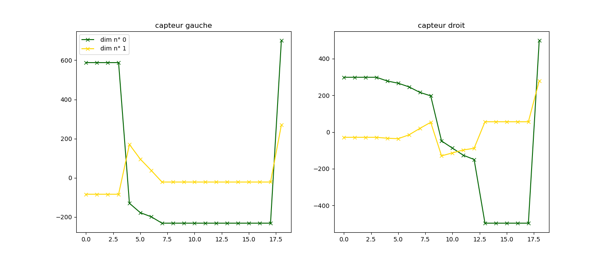
> mouvement n°4 avec 2 dimensions **(même mouvement mais répétition différente)**

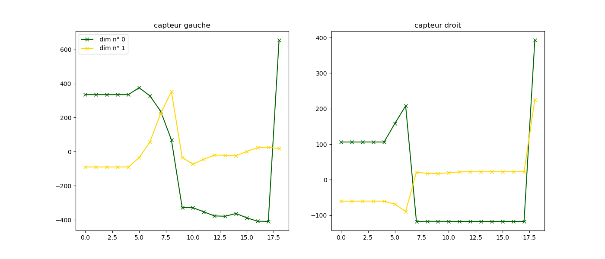
> mouvement n°30 avec 2 dimensions **(mouvement différents)**

* Nous allons effectuer la même démarche mais avec cette fois-ci **2 dimension** via les lignes `mov = m.dimensionReduction(numberOfDimension = 3)` et `showResult(mov)` 
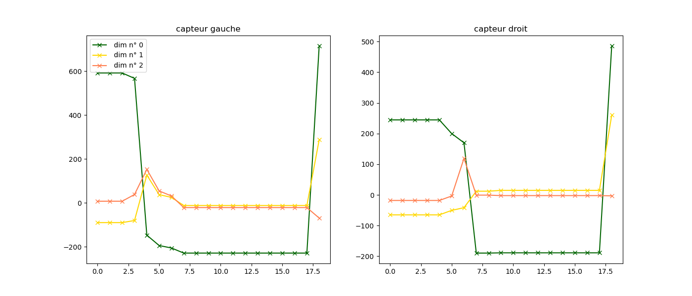
> mouvement n°1 avec 3 dimensions

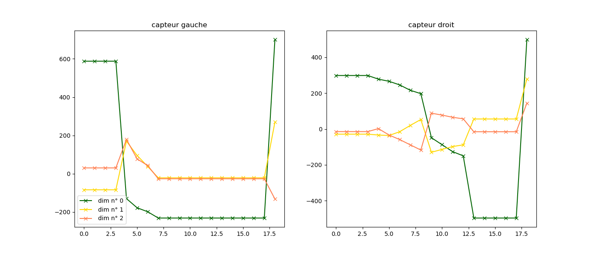
> mouvement n°4 avec 3 dimensions **(même mouvement mais répétition différente)**

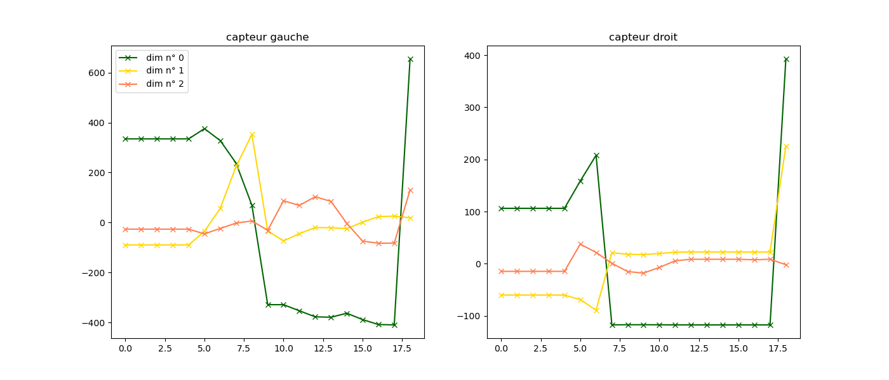
> mouvement n°30 avec 3 dimensions **(mouvement différents)**

#### Notre conclusion : 
* * la réduction de dimensionalité n'entraine pas une perte d'information pour notre tache d'identification des mouvements si le nombre de dimensions par capteur est supérieur ou égal à 2. 
* * Cependant ce processus peut-être energivore en terme de ressource et de temps de calcul. 
