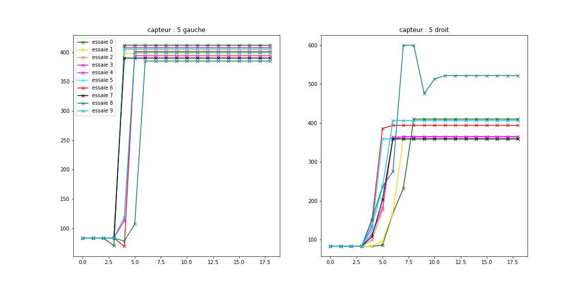

# KPCA Appliqué

Ce petit write up fait suite à celui sur la découverte des KPCA disponible sur le dépot github **[ici](https://github.com/Matomatt/wyes-ai/tree/KPCA/Decouverte_KPCA)**. 
## Sommaire
* [1. Notre problème ](#1-notre-problème)
* [2. Les réductions de dimensionnalité](#2-les-réductions-de-dimensionalité)
* [3. Reduction d'une dimension](#3-réduction-dune-dimension)
* [4. Reduction de deux dimensions](#4-réduction-de-deux-dimensions)
* [5. Reduction de trois dimensions](#5-réduction-de-trois-dimensions)
* [6. Reduction de quatre dimensions](#6-réduction-de-quatre-dimensions)
* [7. Reduction de cinq dimensions](#7-réduction-de-cinq-dimensions)
* [8. Notre code](#8-notre-code)
* [9. Conclusion](#9-conclusion)

## 1. Notre problème
La lecture des informations provenant du dispositif est composé de 12 capteurs (6 pour le coté gauche et 6 autres pour le cotés droit) ce qui nous offres un mouvement un décrit par **6 dimensionalités** pour chaque œil.

> le graphique de gauche correspond aux 6 capteurs de gauche et le graphique de droite aux 6 capteurs situé à à droite. 

Afin d'optimiser et de simplifier notre démarche de reconnaissance et d'identification des mouvements, nous **nous proposons de réduire un maximum le nombre de composantes disponibles**. Nous utiliserons ici le principe de réduction de dimensionnalités permise par les KCPA.   
## 2. Les réductions de dimensionnalité

## 3. Reduction d'une dimension

## 4. Reduction de deux dimensions

## 5. Reduction de trois dimensions

## 6. Reduction de quatre dimensions

## 7. Reduction de cinq dimensions

## 8. Notre code
L'integralité du code se situe dans la classe [movement](movement.py). Le playload qui nous a permis de generer les images de ce write up est disponible dans le fichier [playload](playload.py)
Plusieurs méthodes ont été implémenter dans la classe **movement** : 
* Le constructeurs et les méthodes d'initialisation (tel que la lecture du dataset)
* Les methodes permettant de generer une visualition graphique des mouvement en fonction des capteurs etc.
* La méthode qui permet de "fusionner" deux capteurs afin de réduire le nombre de dimension

## 9. Conclusion